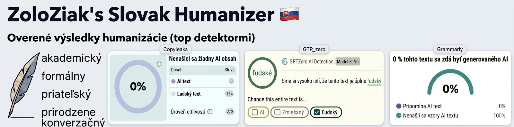

# Humanizer Slovak





## Prepíš slovenský text tak, ako by ho písal človek.

Humanizer skill postavený špecificky na slovenčinu. Nájde 34 vzorcov, ktoré prezrádzajú AI-generovaný text - 27 štýlových a 7 gramatických, čo platia len pre slovenčinu - a text prepíše tak, aby znel prirodzene a ľudsky. 🧑‍🏫


## 4 štýly výstupu

- **Akademický** - odborný, precízny, pre výskum, odborné a akademické práce
- **Formálny** - profesionálny, pre firemnú komunikáciu a produktové texty
- **Priateľský** - vrelý tón, pre blogy, newslettery, sociálne siete
- **Konverzačný** - neformálny, prirodzený, akoby si písal kamošovi


## Čo to robí

- **Zakazuje em dash (—)** - nahrádza ho bežnou pomlčkou (-)
- **Identifikuje slovenské AI klišé** ("V dnešnej dobe", "Je dôležité zdôrazniť", "Na záver možno konštatovať"...)
- **Deteguje anglický slovosled**, kalky, nominalizáciu a ďalšie vzorce typické pre slovenčinu
- **Odstraňuje nafúknutý jazyk**, trpný rod, vágne atribúcie
- **Pridáva osobnosť** a autentický hlas
- **Chráni pred over-humanizovaním** - zoznam "čo NEopravovať" (dokonalá gramatika ≠ AI) + znaky ľudského písania na zachovanie
- **Dual-pass systém**: prepíše → skontroluje → opraví znova
- **4 štýly výstupu:** akademický, formálny, priateľský, konverzačný

## Smrť em dashu! 🥳

Poznáte ten dlhý pomlčkový znak **—**, čo je doslova v každom AI texte? Ten, čo žiadny "normálny" Slovák NIKDY v živote nenapíše, lebo na klávesnici jednoducho stlačí pomlčku "-"? Tak ten už vo svojom texte neuvidíte. <br>
Je to na prvý pohľad najviditeľnejší znak AI textu a je úplne všade. Toto je prvý humanizer, ktorý ho rieši natvrdo ako globálne pravidlo.


## Príklad

**Vstup (typický AI text):**
> V dnešnej rýchlo sa meniacej digitálnej dobe je čoraz dôležitejšie venovať pozornosť oblasti umelej inteligencie. Je dôležité zdôrazniť, že AI predstavuje revolučnú technológiu, ktorá zásadným spôsobom mení krajinu moderného podnikania.

**Výstup (štýl: priateľský):**
> AI v podnikaní riešia firmy teraz, nie o päť rokov. Gartner hovorí, že ju testuje 65 % stredných firiem v Európe, ale úprimne - väčšina z nich len skúša, čo to vlastne dokáže.


## 39 detegovaných vzorcov

### 27 štýlových (aby to neznelo ako AI)

| # | Vzorec | Príklad |
|---|--------|---------|
| 1 | Nafúknuté otváracie frázy | "V dnešnej dobe..." |
| 2 | Prehnané zdôrazňovanie | "Je dôležité zdôrazniť..." |
| 3 | Formulaické závery | "Na záver možno konštatovať..." |
| 4 | Nadužívanie spojok | "Napriek tomu", "Okrem toho", "V neposlednom rade" |
| 5 | Prehnaná formálnosť | "Dosiahol sa", "Je potrebné" |
| 6 | Pravidlo troch | Trojice prídavných mien/príkladov |
| 7 | Propagačný jazyk | "Revolučný", "Inovatívny", "Komplexné riešenie" |
| 8 | Vágne atribúcie | "Odborníci sa zhodujú", "Štúdie ukazujú" |
| 9 | Nadužívanie pomlčiek | Prehnaný em dash (—) |
| 10 | Prehnané formátovanie | Tučné nadpisy v zoznamoch |
| 11 | Emoji dekorácie | Emoji v nadpisoch |
| 12 | Chatbot artefakty | "Skvelá otázka!", "Rád pomôžem" |
| 13 | Synonymické koliesko | Spoločnosť/firma/podnik/korporácia |
| 14 | Falošné rozsahy | "Od startupov po korporácie" |
| 15 | Generické závery | "Budúcnosť vyzerá sľubne" |
| 16 | Výplňové frázy | "S cieľom dosiahnuť", "Vzhľadom na to, že" |
| 17 | Anglický slovosled | Porušenie aktuálneho vetného členenia |
| 18 | Monotónny rytmus | Všetky vety podobnej dĺžky (nízka burstiness) |
| 19 | Privlastňovacie zámená | "Otvoril svoje oči a vzal svoj telefón" |
| 20 | Anglické kalky | "Poďme sa ponoriť do", "na dennej báze" |
| 21 | Nadmerná nominalizácia | "Došlo k realizácii implementácie" |
| 22 | Meta-komentáre | "V tomto článku sa pozrieme na..." |
| 23 | Falošná vyváženosť | "Na jednej strane... na druhej strane..." |
| 24 | Ukazovacie zámená | "Tento problém... Táto situácia... Tieto faktory..." |
| 25 | Copula avoidance | "Predstavuje kľúčový nástroj" namiesto "je" |
| 26 | Sendvičová štruktúra | Úvod - 3 body - záver vždy |
| 27 | Tautologické zdvojenia | "rôzne a rozmanité", "efektívne a účinné" |

### 7 slovensko-špecifických (aby to bola správna slovenčina)

Toto je hlavný rozdiel oproti českej verzii. LLM "myslí" po anglicky a videl oveľa viac češtiny než slovenčiny, takže keď si nie je istý, podteká do angličtiny (slovosled, kalky) alebo do češtiny (bohemizmy, dĺžne). Tieto vzory to zachytávajú.

| # | Vzor | Príklad |
|---|------|---------|
| 28 | Bohemizmy | "další", "teď", "protože" → "ďalší", "teraz", "pretože" |
| 29 | Rytmický zákon | "krásný", "múdrý" → "krásny", "múdry" (krátenie po dlhej slabike) |
| 30 | Vokalizácia predložiek | "v vode", "s sestrou" → "vo vode", "so sestrou" |
| 31 | Poradie prízvučných tvarov | "chcel opýtať sa ho" → "chcel som sa ho opýtať" (som/si/sa/mi/ho) |
| 32 | Podmieňovací spôsob | "bych", "abych", "kdybych" → "by som", "aby som", "keby som" |
| 33 | Mäkčene a mäkké ľ | "ludia", "učitel" → "ľudia", "učiteľ" |
| 34 | Vybrané slová a sústava i/y | "byt spolu", "vi ste" → "byť spolu", "vy ste" |

### 5 prevzatých z anglického humanizeru (blader/humanizer)

Univerzálne vzory (nie viazané na jazyk), ktoré identifikoval [blader/humanizer](https://github.com/blader/humanizer) v novších verziách.

| # | Vzor | Príklad |
|---|------|---------|
| 35 | Negatívne paralelizmy | "nie je to len o…, je to…", "nielen… ale aj…" |
| 36 | Diff-anchored písanie | opisuje zmenu namiesto veci samej |
| 37 | Vyrobené pointy / staccato dráma | séria krátkych fragmentov na umelú drámu |
| 38 | Aforizmové formulky | "X je jazykom Y", "X sa stáva pascou" |
| 39 | Konverzačné rečnícke otvárače | "Úprimne?", "Pozri,", "Ide o to, že" |


> [!NOTE]
> **Výsledky detektorov:** Vzali sme extra ťažko AI-generovaný text, pri ktorom všetky detektory hlásili, že je na 100 % generovaný AI. Prehnali sme ho týmto slovak humanizerom a nechali otestovať top detektory. Výsledok?<br>
> Copyleaks: 0% AI. ✅<br>
> GPTZero: "entirely human". ✅<br>
> Grammarly: 0% AI. ✅


---

## 🔧 Inštalácia

### Claude Code (odporúčané)

```bash
# Naklonuj do priečinka skills
mkdir -p ~/.claude/skills
git clone https://github.com/ZoloZiak/humanizer-slovak.git ~/.claude/skills/humanizer-slovak
```

Potom v Claude Code použi `/humanizer-slovak` nasledované textom na humanizáciu.

### Claude.ai (Projects)

1. Stiahni [SKILL.md](SKILL.md) (alebo celý ZIP cez zelené tlačidlo "Code")
2. V claude.ai otvor Settings → Customize → Skills
3. Nahraj SKILL.md ako nový skill

### ChatGPT, Gemini, Copilot, Mistral a ďalšie LLM

1. Otvor [PROMPT.md](PROMPT.md)
2. Skopíruj celý obsah
3. Vlož ako systémový prompt (system instructions) alebo na začiatok konverzácie
4. Pošli text na humanizáciu

---

## Poďakovanie

Toto je slovenská adaptácia projektu [humanizer-czech](https://github.com/bejek/humanizer-czech) od [@bejek](https://github.com/bejek) - celá zásluha za pôvodnú myšlienku, štruktúru a 27 vzorcov patrí jemu. Český projekt vychádza z projektu [humanizer](https://github.com/blader/humanizer) od [@blader](https://github.com/blader) - pôvodnej anglickej verzie s 10k+ hviezdičkami.

Slovenská verzia k tomu pridáva 7 gramatických vzorov (28-34), ktoré platia len pre slovenčinu a čeština ich riešiť nemusí: LLM je v slovenčine slabšie natrénovaný a podteká do angličtiny alebo češtiny.

Vychádza tiež z [Wikipedia: Signs of AI writing](https://en.wikipedia.org/wiki/Wikipedia:Signs_of_AI_writing).

Vzorce 17-27 identifikované cross-referenciou výstupov z Claude, ChatGPT a Gemini.

---

## Licencia

[MIT](LICENSE) - používaj ako chceš, komerčne aj nekomerčne.

---